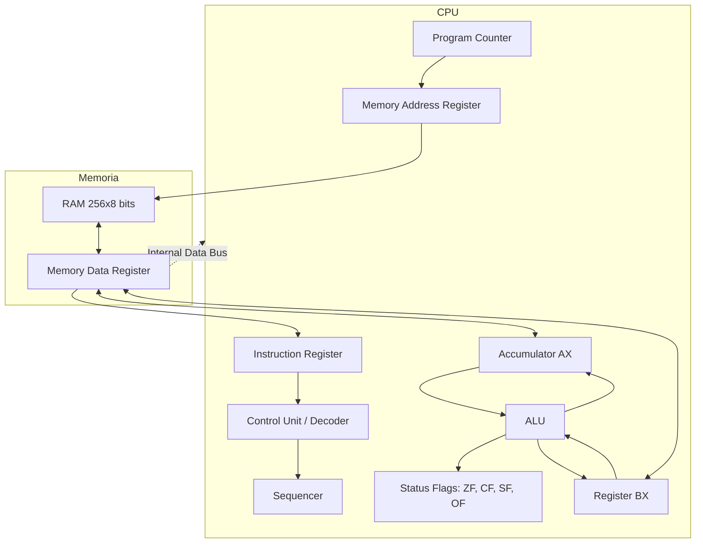

# Simulador de CPU 8-bits - Entregable Final

Proyecto correspondiente al Parcial 1 de Arquitectura de Computadoras. Este repositorio contiene el entregable final de un simulador de una CPU de 8 bits implementado íntegramente en Google Sheets mediante Google Apps Script (JavaScript), replicando fielmente el diagrama y funcionamiento de la arquitectura de Von Neumann propuesto por Eduardo Alcalde Lancharro.

## Arquitectura (Arquitectura de Von Neumann)

## Tabla ISA (Instruction Set Architecture)

| Mnemónico | Hex | Descripción |
|---|---|---|
| HLT | 00 | Halt - Detiene la ejecución |
| MOV AX, imm | 10 | Mueve un valor inmediato a AX |
| MOV BX, imm | 11 | Mueve un valor inmediato a BX |
| LOAD AX, [dir] | 20 | Carga en AX el valor de memoria |
| STORE [dir], AX | 22 | Guarda AX en memoria |
| ADD AX, BX | 32 | Suma BX a AX (AX = AX + BX) |
| SUB AX, BX | 42 | Resta BX de AX (AX = AX - BX) |
| CMP AX, BX | 52 | Compara AX y BX (actualiza Flags) |
| INC AX | 60 | Incrementa AX en 1 |
| DEC BX | 61 | Decrementa BX en 1 |
| AND AX, BX | 72 | Operación lógica AND |
| OR AX, BX | 82 | Operación lógica OR |
| XOR AX, BX | 92 | Operación lógica XOR |
| NOT AX | 6A | Inversión de bits de AX |
| JMP dir | A0 | Salto incondicional |
| JZ dir | A1 | Salto si Zero (ZF=1) |
| JC dir | A2 | Salto si Carry (CF=1) |

## Manual de Usuario Paso a Paso

1.  **Preparación de la Hoja:** Al abrir el documento de Google Sheets, el menú personalizado "Simulador CPU" se cargará en la barra superior.
2.  **Construir Diagrama:** Si es la primera vez, haz clic en `Simulador CPU` -> `Preparar diagrama` para renderizar todos los componentes, registros y buses usando el formato de celdas de la hoja.
3.  **Cargar Código:** Puedes escribir manualmente en la pestaña `Memoria` o seleccionar `Simulador CPU` -> `Cargar demo: multiplicación` para inyectar el programa de prueba predefinido.
4.  **Ejecución Paso a Paso:** Haz clic en `Simulador CPU` -> `PASO · una microoperación` para avanzar una micro-operación a la vez. Verás partículas animadas iluminar el bus correspondiente (direcciones en oscuro, datos en claro) y verás la micro-orden actual en la pantalla inferior.
5.  **Ejecución Completa:** Haz clic en `Simulador CPU` -> `EJECUTAR` para que el simulador corra automáticamente. Puedes cambiar la velocidad modificando la celda de la pausa en la hoja `Diagrama`.
6.  **Pausar y Reiniciar:** Puedes detener la simulación desde el menú con `PAUSAR` o vaciar el estado conservando la RAM usando `RESET · conservar RAM`.

## Traza Matemática Iteración por Iteración (Programa de Prueba)

**Objetivo:** Multiplicación de 3 x 2 mediante sumas sucesivas.
Programa:
- 00h: MOV AX, 00h (Inicializa acumulador en 0)
- 02h: MOV BX, 03h (Carga 3)
- 04h: STORE [80h], AX (Guarda sumatoria en dir 80h)
- 06h: MOV AX, 02h (Carga contador 2)
- 08h: STORE [81h], AX (Guarda contador en dir 81h)
- Bucle:
- 0Ah: LOAD AX, [80h] (Trae sumatoria)
- 0Ch: ADD AX, BX (Suma 3)
- 0Dh: STORE [80h], AX (Actualiza sumatoria)
- 0Fh: LOAD AX, [81h] (Trae contador)
- 11h: DEC AX (Resta 1 al contador)
- 12h: STORE [81h], AX (Actualiza contador)
- 14h: JNZ 0Ah (Salta si no es cero)
- 16h: HLT (Fin)

**Traza:**
*   **Iteración 1:**
    *   Sumatoria inicial (Mem[80h]) = 0.
    *   Contador inicial (Mem[81h]) = 2.
    *   ALU hace `0 + 3 = 3`. Se guarda 3 en Mem[80h].
    *   ALU hace `2 - 1 = 1`. Se guarda 1 en Mem[81h].
    *   JNZ evalúa `ZF=0` (el contador no es 0). **Salta a 0Ah**.
*   **Iteración 2:**
    *   Carga Sumatoria (3).
    *   ALU hace `3 + 3 = 6`. Se guarda 6 en Mem[80h].
    *   Carga Contador (1).
    *   ALU hace `1 - 1 = 0`. Se guarda 0 en Mem[81h].
    *   JNZ evalúa `ZF=1` (el contador llegó a 0). **No salta**.
*   **Fin:** 
    *   PC pasa a 16h y ejecuta HLT. El resultado final de `3 * 2 = 6` reposa en la RAM en la dirección `80h`.

## 📦 Código Fuente
Todo el código lógico, la decodificación de instrucciones y la animación de la interfaz están contenidos en el script `src_gs/Code.gs` desarrollado en JavaScript para el entorno de Google Apps Script.
